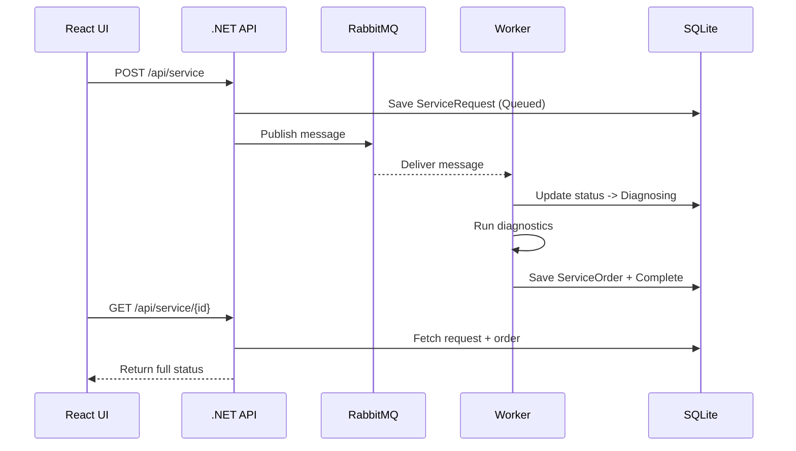

# AutoPit – Vehicle Service System
*A Dealership Service Workflow built with .NET 9, React, RabbitMQ (6.6.0), Docker Compose & SQLite*

---

# 🚗 Overview

AutoPit is a complete end-to-end sample system representing a lightweight dealership service pipeline:

1. Front desk creates service requests for vehicles.
2. Requests flow into RabbitMQ.
3. Background worker processes requests, simulating diagnostics.
4. Service Orders (findings, technician, estimate) are generated.
5. React UI provides an interface for interaction.
6. SQLite stores all vehicle, request, and order data.

This project showcases event-driven architecture, distributed workflow patterns, background processing, and modern .NET 9 development.

---

# 🏗️ Solution Structure

```
AutoPit/
│
├── src/
│   ├── AutoPit.Core/              # Domain models, interfaces, validation
│   ├── AutoPit.Infrastructure/    # RabbitMQ 6.6.0, SQLite store, processor logic
│   ├── AutoPit.Api/               # .NET 9 Minimal API
│   ├── AutoPit.Worker/            # Background worker
│   └── AutoPit.Web/               # React + Vite + TS UI
│
├── tests/
│   └── AutoPit.Tests/             # xUnit tests
│
├── docker-compose.yml
└── README.md
```

---

# ✅ Architecture Diagram

```mermaid
flowchart LR
    A[React UI<br/>Vite/TypeScript] -- REST --> B[AutoPit API (.NET 9)]
    B -- SQLite CRUD --> C[(SQLite DB)]
    B -- Publish Request --> D[RabbitMQ Queue]
    D -- Consume Request --> E[Worker<br/>BackgroundService]
    E -- Write Order --> C
    E -- Update Status --> C
```

---

# ✅ Component Breakdown

### **AutoPit.Core**
- Domain models: `Car`, `ServiceRequest`, `ServiceOrder`
- Interfaces: `IAutoStore`, `IMessageBus`, `IServiceProcessor`

### **AutoPit.Infrastructure**
- SQLite persistence using Dapper
- RabbitMQ Bus (6.6.0) using `IConnection` + `IModel`
- ChannelBus for dev
- Diagnostic ServiceProcessor

### **AutoPit.Api**
- Minimal API endpoints:
  - `/api/cars`
  - `/api/service`
  - `/api/service/{id}`
  - `/api/service/inqueue`
- Swagger enabled
- CORS enabled for React UI

### **AutoPit.Worker**
- Consumes messages from RabbitMQ
- Updates service request statuses
- Generates technician findings & estimated cost
- Writes ServiceOrder into SQLite

### **AutoPit.Web (React UI)**
- Vite + TypeScript + React
- Pages:
  - Add Car
  - Create Service Request
  - Check Status
  - View Queue

---

# ✅ Event Flow Diagram



---

# ✅ Data Models

### Car
```
{
  "vin": "string",
  "make": "string",
  "model": "string",
  "year": 2019,
  "trim": "EX"
}
```

### Service Request
```
{
  "id": "guid",
  "vin": "string",
  "concern": "string",
  "priority": 1,
  "createdUtc": "ISO8601",
  "status": "Queued | Diagnosing | Complete | Failed"
}
```

### Service Order
```
{
  "requestId": "guid",
  "technician": "string",
  "findings": "string",
  "estimatedCost": 123.45,
  "completedUtc": "ISO8601"
}
```

---

# ✅ API Endpoints

### **POST /api/cars**
Add or update a car.

### **POST /api/service**
Create a new service request.

### **GET /api/service/{id}**
Fetch request + order.

### **GET /api/service/inqueue**
Fetch all queued requests.

---

# ✅ React UI

### Install
```
cd src/AutoPit.Web
npm install
```

### Run
```
npm run dev
```

Default UI URL:
```
http://localhost:5173
```

---

# ✅ Running with Docker Compose

From repository root:

```
docker compose up --build
```

Services:

| Service | URL |
|--------|------|
| React UI | http://localhost:5173 |
| API | http://localhost:5190 |
| Swagger | http://localhost:5190/swagger |
| RabbitMQ UI | http://localhost:15672 |
| Worker | runs in background |

---

# ✅ SQLite Database

Uses file:
```
autopit.db
```

Stored in container volume `apidata`.

---

# ✅ RabbitMQ (6.6.0)

### Exchange:
`autopit.exchange`

### Queue:
`autopit.service`

### Dashboard:
```
http://localhost:15672
guest / guest
```

---

# ✅ Local Development (No Docker)

### API
```
dotnet run --project src/AutoPit.Api
```

### Worker
```
dotnet run --project src/AutoPit.Worker
```

### React UI
```
npm run dev
```

---

# ✅ Tests

```
dotnet test
```

---

# ✅ Extending AutoPit

- Add authentication (JWT)
- Replace SQLite with PostgreSQL
- Add metrics + OpenTelemetry
- Add retry queues & DLQs
- Expand UI with dashboards + charts

---

# ✅ License

MIT License

